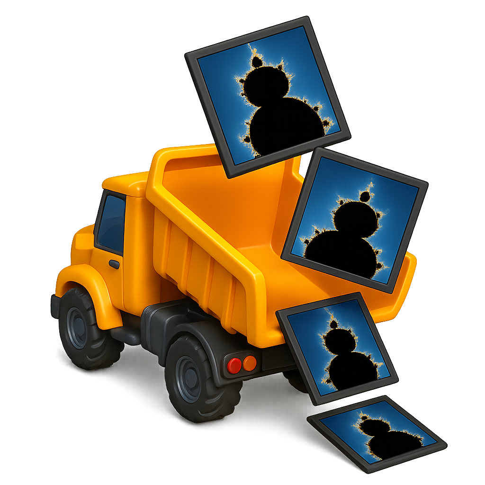

<p align="center">
  
</p>

# ShaderDump

**ShaderDump** is a lightweight command-line tool (in Python) for rendering [ShaderToy](https://shadertoy.com) GLSL fragment shaders to image sequences, suitable for conversion to video.  It is GPU accelerated and supports supersampling, as well as any target resolution/framerate.  Images can be output in any format supported by the [Pillow](https://pillow.readthedocs.io/en/stable/) image library (PNG, JPG, etc.)

I wrote this script because all the other ones I could find on the web were broken.  This one will be broken too someday, but for the moment it works.

_**Note:** The current version of ShaderDump does not produce correct output for shaders that depend on ShaderToy.com assets (textures, etc.)._

---

## Input

Just paste your entire ShaderToy fragment shader code into a `.frag` file. For example:

```glsl
void mainImage(out vec4 fragColor, in vec2 fragCoord) {
    vec2 uv = fragCoord / iResolution.xy;
    float c = 0.5 + 0.5*cos(iTime + uv.xyx + vec3(0,2,4));
    fragColor = vec4(c,1.0);
}
```

> Note: Do not include a `#version` line or `main()` function — ShaderDump wraps your code automatically.

---

## Dependencies

Python 3.7+ is required. Install dependencies via:

```bash
pip install moderngl numpy pillow
```

> You may also need to install an OpenGL driver or use a software renderer (e.g., Mesa) if you're running on a headless system (but should be able to run from the command line if you have a display).

---

## Usage

```bash
./shaderdump.py -i myshader.frag
```

### Optional arguments

| Flag               | Description                                                    | Default              |
|--------------------|----------------------------------------------------------------|----------------------|
| `-i`, `--input`     | Path to input `.frag` file containing your ShaderToy code     | required             |
| `-o`, `--output`    | Output path pattern using `printf`-style formatting           | `./out%04d.png`      |
| `--fps`             | Frames per second                                             | `60`                 |
| `-t0`, `--startTime`| Start time in seconds                                         | `0.0`                |
| `-t1`, `--endTime`  | End time in seconds                                           | `1.0`                |
| `-w`, `--width`     | Output image width                                            | `1920`               |
| `-H`, `--height`    | Output image height                                           | `1080`               |
| `--supersample`     | Supersampling factor (antialiasing) | `2`              |

Example with full control:

```bash
./shaderdump.py \
  -i mandelbrot.frag \
  -o frames/zoom_%04d.jpg \
  --fps 60 -t0 0 -t1 10 \
  -w 1280 -H 720 \
  --supersample 2
```

---

## Convert to Video

Once rendered, you can convert frames to a video using `ffmpeg`:

```bash
ffmpeg -framerate 60 -i frames/zoom_%04d.jpg -c:v libx264 -pix_fmt yuv420p zoom.mp4
```

---

## Disclaimer

This script was largely authored with the assistance of an AI language model (ChatGPT 4o). It has been tested only lightly, and may contain bugs or edge cases that are not fully handled. Please report issues or submit pull requests to improve robustness.

---

## License

MIT License. See [LICENSE](LICENSE) file.
